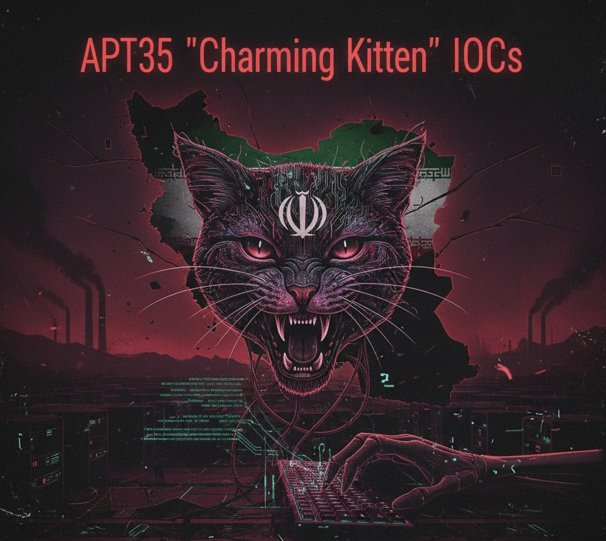

# APT35 (Charming Kitten) - Indicators of Compromise

**Threat Actor:** APT35 / Charming Kitten / Phosphorus / Newscaster  
**Attribution:** Islamic Republic of Iran  
**Last Updated:** October 2025

---

## Executive Summary

This repository contains comprehensive Indicators of Compromise (IOCs) for APT35, an Iranian state-sponsored Advanced Persistent Threat group active since 2011. The intelligence is derived from leaked operational documents and enriched with multi-source threat intelligence.

**Primary Objectives:**
- Foreign intelligence collection
- Credential harvesting
- Long-term espionage operations
- Strategic information gathering

**Known Aliases:**
- APT35
- Charming Kitten
- Phosphorus (Microsoft designation)
- Newscaster
- Ajax Security Team
- NewsBeef
- Cobalt Illusion

---

## Threat Actor Profile

### Targeting

**Geographic Focus:**
- Middle East (Iran, Saudi Arabia, Lebanon, Kuwait, Jordan)
- Europe (Finland, Turkey)
- Asia (South Korea)
- North America (United States)

**Sector Targeting:**
- Government and diplomatic entities
- Defense contractors and military
- Academic institutions and researchers
- Think tanks and policy organizations
- Journalists and media organizations
- Dissidents and opposition groups
- Telecommunications providers

### Tactics, Techniques, and Procedures

**MITRE ATT&CK Mapping:**
- **Initial Access:** Spear-phishing (T1566), Exploit Public-Facing Application (T1190)
- **Execution:** PowerShell (T1059.001), Web Shells (T1505.003)
- **Persistence:** Web Shell (T1505.003), Scheduled Task (T1053.005)
- **Privilege Escalation:** Exploitation for Privilege Escalation (T1068)
- **Defense Evasion:** Obfuscated Files or Information (T1027)
- **Credential Access:** Credential Dumping (T1003), Input Capture (T1056)
- **Discovery:** Network Service Scanning (T1046), System Information Discovery (T1082)
- **Collection:** Email Collection (T1114), Data from Local System (T1005)
- **Exfiltration:** Exfiltration Over C2 Channel (T1041)

---

## IOC Summary

| Category | Count | Description |
|----------|-------|-------------|
| IP Addresses | 3,233 | Command & control, phishing infrastructure, exploitation servers |
| Domains | 3,518 | Malicious domains used in operations |
| Email Addresses | 7,348 | Phishing senders, operational accounts |
| URLs | 1,309 | Phishing links, malware distribution |
| File Hashes | 144 | Malware samples (MD5, SHA1, SHA256) |
| CVEs | 33 | Vulnerabilities exploited in campaigns |

---

## Repository Structure

```
APT35-IOCs/
│
├── README.md                          # This document
│
├── IOCs/
│   ├── ips.csv                       # IP addresses with Shodan enrichment
│   ├── domains.csv                   # Malicious domains
│   ├── emails.csv                    # Email indicators
│   ├── urls.csv                      # Malicious URLs
│   ├── hashes.csv                    # File hashes
│   ├── cves.csv                      # CVEs exploited
│   ├── high_confidence_iocs.csv      # Filtered high-confidence indicators
│   └── master_feed.json              # Complete IOC feed (JSON format)
│
└── YARA/
    └── apt35_rules.yar               # YARA detection rules
```

---

## IOC Confidence Levels

All indicators are assigned confidence scores based on multiple factors:

| Level | Score Range | Criteria |
|-------|-------------|----------|
| **Very High** | 80-100 | Multiple independent sources + technical enrichment |
| **High** | 60-79 | Multiple sources OR strong technical validation |
| **Medium** | 40-59 | Single reliable source with context |
| **Low** | <40 | Single mention, limited corroboration |

---

## Key Campaign Infrastructure

### ProxyShell Exploitation
APT35 conducted mass exploitation of Microsoft Exchange servers using ProxyShell vulnerabilities:
- CVE-2021-34473
- CVE-2021-34523  
- CVE-2021-31207

**Targets:** Government, telecommunications, and defense organizations across Middle East and Asia.

### Credential Harvesting Operations
- Google Account phishing panels
- OAuth token theft
- Multi-factor authentication bypass
- Conference invitation lures

### Ivanti VPN Exploitation
Recent campaigns targeting Ivanti Connect Secure VPN appliances for initial access.

---

## Detection and Response

### Network Indicators

**Block at Perimeter:**
```
# Firewall rules - block known C2 infrastructure
deny ip from any to 91.132.197.186
deny ip from any to 104.129.28.18
# See IOCs/ips.csv for complete list
```

**DNS Sinkholing:**
```
# Redirect malicious domains to sinkhole
*.ameen-alkhalij.com    CNAME sinkhole.local
# See IOCs/domains.csv for complete list
```

### SIEM Detection Rules

**Splunk:**
```spl
index=proxy OR index=firewall 
| lookup apt35_iocs.csv ip AS dest_ip OUTPUT threat_level
| where threat_level="high" OR threat_level="very_high"
| stats count by src_ip, dest_ip, threat_level
```

**Elastic Stack:**
```json
{
  "query": {
    "bool": {
      "should": [
        {"terms": {"destination.ip": ["91.132.197.186", "104.129.28.18"]}},
        {"wildcard": {"dns.question.name": "*ameen-alkhalij.com"}}
      ]
    }
  }
}
```

### Endpoint Detection

**YARA Rules:**
See `YARA/apt35_rules.yar` for detection signatures.

**PowerShell Logging:**
Monitor for suspicious PowerShell execution patterns associated with APT35 tools.

---

## Threat Intelligence Platform Integration

### MISP (Malware Information Sharing Platform)

```bash
# Import IOCs into MISP
curl -X POST https://your-misp/events/upload_sample \
  -H "Authorization: YOUR_API_KEY" \
  -F "files=@IOCs/master_feed.json"
```

### OpenCTI

```python
from pycti import OpenCTIApiClient

# Import indicators
client = OpenCTIApiClient(url, token)
with open('IOCs/master_feed.json') as f:
    indicators = json.load(f)
    client.stix2.import_bundle(indicators)
```

### Apache NiFi

JSON feeds are optimized for NiFi ingestion. Use `GetFile` processor to ingest `master_feed.json`.

---

## Defensive Recommendations

### Immediate Actions

1. **Block Infrastructure**
   - Import IP addresses from `ips.csv` into firewall deny lists
   - Configure DNS filtering for domains in `domains.csv`
   - Block email senders from `emails.csv` at mail gateway

2. **Vulnerability Management**
   - Prioritize patching CVEs listed in `cves.csv`
   - Focus on ProxyShell vulnerabilities if running Exchange
   - Review Ivanti Connect Secure for indicators of compromise

3. **Hunt for Compromise**
   - Search logs for connections to known C2 infrastructure
   - Review authentication logs for accounts in `emails.csv`
   - Scan for file hashes in `hashes.csv`

### Long-Term Hardening

- Implement multi-factor authentication (MFA) across all services
- Deploy endpoint detection and response (EDR) solutions
- Enable PowerShell script block logging
- Implement application whitelisting
- Regular threat hunting exercises focused on APT35 TTPs

---

## Data Sources and Methodology

### Primary Sources
- Leaked operational documents from APT35 infrastructure
- Technical malware analysis
- Network traffic analysis
- Open-source intelligence (OSINT)

### Enrichment Sources
- Shodan API (infrastructure reconnaissance)
- DNS resolution data
- WHOIS/RDAP records
- CVE/NVD vulnerability data
- Relationship graph analysis

### Quality Assurance
- Multi-source validation
- False positive filtering
- Confidence scoring algorithm
- Regular updates based on new intelligence

---

## Usage and Legal

### Permitted Use
- Defensive cybersecurity operations
- Threat hunting and incident response
- Security research and analysis
- Threat intelligence enrichment
- Educational purposes

### Prohibited Use
- Offensive cyber operations
- Unauthorized network access
- Any illegal activities

### Attribution
When using this intelligence, please cite:
```
APT35 IOC Repository, https://github.com/JayGLXR/APT35-IOCs
```

---

## Contributing

Contributions are welcome. To submit additional IOCs:

1. Fork this repository
2. Add IOCs with proper source attribution and confidence scoring
3. Ensure data is properly sanitized
4. Submit pull request with detailed description
5. Include validation methodology

**Contribution Guidelines:**
- Provide source context for all IOCs
- Include timestamps and confidence assessments
- Follow existing CSV/JSON formats
- Anonymize sensitive victim information

---

## References and Further Reading

### Threat Reports
- [MITRE ATT&CK - APT35](https://attack.mitre.org/groups/G0059/)
- [Microsoft Digital Security Unit - Phosphorus](https://www.microsoft.com/security/blog/tag/phosphorus/)
- [Recorded Future - Charming Kitten](https://www.recordedfuture.com/charming-kitten)
- [ClearSky Cyber Security - Iranian Threat Landscape](https://www.clearskysec.com/iranian-apt/)
- [Check Point Research - APT35 Analysis](https://research.checkpoint.com/tag/apt35/)

### CVE References
- [CVE-2021-34473 - ProxyShell](https://nvd.nist.gov/vuln/detail/CVE-2021-34473)
- [CVE-2021-34523 - ProxyShell](https://nvd.nist.gov/vuln/detail/CVE-2021-34523)
- [CVE-2021-31207 - ProxyShell](https://nvd.nist.gov/vuln/detail/CVE-2021-31207)

---

## License

This work is licensed under the **Creative Commons Attribution-ShareAlike 4.0 International License**.

You are free to:
- Share — copy and redistribute the material
- Adapt — remix, transform, and build upon the material

Under the following terms:
- Attribution — Provide appropriate credit
- ShareAlike — Distribute under same license
- No additional restrictions

Full license: https://creativecommons.org/licenses/by-sa/4.0/

---

## Contact and Updates

**Repository Maintainer:** JayGLXR  
**Issues:** Report via GitHub Issues  
**Updates:** Watch this repository for new IOCs and intelligence  

### Changelog

**October 2025 - Initial Release**
- 15,585 total indicators across all categories
- Shodan enrichment for 3,233 IP addresses
- CVE severity scoring for 33 vulnerabilities
- Relationship graph analysis
- Multi-source confidence scoring
- Complete attribution package


